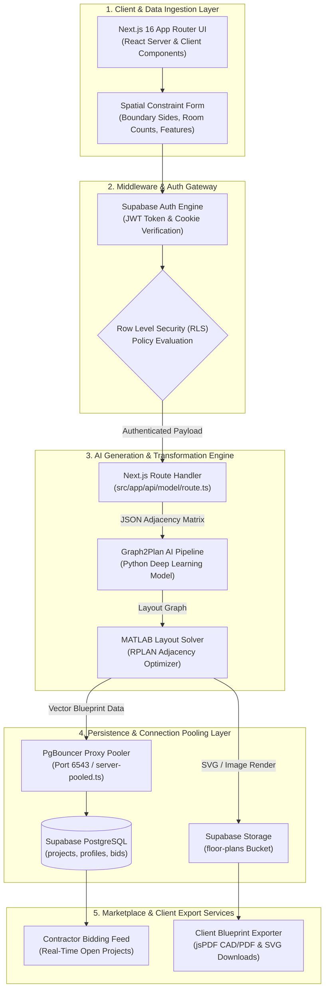

<div align="center">
  
</div>

<h1 align="center">📐 Planik-AI</h1>

<div align="center">

[](https://nextjs.org/)
[](https://www.typescriptlang.org/)
[](https://supabase.com/)
[](https://www.python.org/)
[](https://tailwindcss.com/)
[](LICENSE)

</div>

<br />

> **Planik-AI bridges architectural conceptualization and construction execution by combining graph-based deep learning floorplan generation with a secure, real-time contractor bidding marketplace.**

---

## Table of Contents

- [Overview & Key Features](#overview--key-features)
- [System Architecture & Data Flow](#system-architecture--data-flow)
- [Technical Deep Dive](#technical-deep-dive)
- [Quick Start Guide](#quick-start-guide)
- [Configuration Reference](#configuration-reference)
- [Troubleshooting & Diagnostics](#troubleshooting--diagnostics)

---

## Overview & Key Features

**Planik-AI** is an end-to-end platform designed to automate residential floorplan generation and streamline client-contractor interactions. By translating user-defined plot dimensions, room counts, and structural constraints into layout graph adjacency matrices, the platform uses deep learning models to produce spatial configurations in seconds. 

Generates production-grade blueprints while providing an open bidding marketplace for verified contractors.

- **Graph-Based AI Layout Generation**: Utilizes deep neural layout graph optimization (**Graph2Plan** & **RPLAN-Toolbox**) to convert vector boundary inputs and room connectivity requirements into valid architectural floorplans.
- **Real-Time Contractor Marketplace**: Dedicated workflows for clients to publish generated projects and contractors to submit itemized financial, material, and timeline bids.
- **Edge Connection Pooling**: Custom server-side PgBouncer proxy wrapper (`server-pooled.ts`) eliminates connection saturation under heavy computational rendering loads.
- **Zero-Trust Database Security**: Strict PostgreSQL Row Level Security (**RLS**) policies isolate client proposals, contractor bids, and real-time conversation streams.
- **Multi-Format Vector Export Engine**: Client-side parsing pipeline generating high-resolution SVG, PNG, and production-ready CAD/PDF blueprints via integrated `jspdf` rendering.

---

## System Architecture & Data Flow

The following sequence details how spatial inputs pass through authentication, API routing, AI neural layout solvers, persistent storage, and contractor delivery.



---

## Technical Deep Dive

### 1. Spatial AI Execution Bridge (`src/app/api/model/route.ts`)
The AI generation pipeline translates user inputs into boundary vectors. The route handler validates JSON payload schemas containing plot boundary sides (`[{id, label, length}]`) and target room counts before spawning an isolated sub-process. 

This process passes serialized adjacency matrices into the **Graph2Plan** deep learning network, which returns generated wall boundary coordinate arrays and room assignment polygons.

```typescript
// Abbreviated sub-process execution wrapper logic
const pyProcess = spawn('python', ['Graph2Plan/inference.py', JSON.stringify(payload)]);
pyProcess.stdout.on('data', (data) => {
  const result = JSON.parse(data.toString());
  // Mutate raw layout graph vectors into architectural SVG output
});
```

### 2. High-Throughput Connection Pooling (`src/lib/supabase/server-pooled.ts`)
Serverless Next.js edge route invocations can quickly exhaust PostgreSQL pool limits during simultaneous generation passes. 

Planik-AI mitigates TCP connection overhead by establishing a persistent singleton client pool routed through Supabase's **PgBouncer** transactional proxy engine on port `6543`.

```typescript
import { createClient } from '@supabase/supabase-js';

export const getPooledServerClient = () => {
  return createClient(
    process.env.NEXT_PUBLIC_SUPABASE_URL!,
    process.env.SUPABASE_SERVICE_ROLE_KEY!,
    { auth: { persistSession: false }, db: { schema: 'public' } }
  );
};
```

### 3. PL/pgSQL Atomic Profile Provisioning (`database-schema.sql`)
User identity registration uses a PostgreSQL trigger executing under `SECURITY DEFINER` privileges. When a user completes signup via Supabase Auth, `handle_new_user()` intercepts the insertion event on `auth.users` and creates a matching profile in `public.profiles` while validating role constraints (`client`, `contractor`, or `admin`).

```sql
CREATE OR REPLACE FUNCTION public.handle_new_user()
RETURNS TRIGGER AS $$
BEGIN
  INSERT INTO public.profiles (id, email, full_name, role)
  VALUES (
    NEW.id,
    NEW.email,
    NEW.raw_user_meta_data->>'full_name',
    COALESCE(NEW.raw_user_meta_data->>'role', 'client')
  );
  RETURN NEW;
END;
$$ LANGUAGE plpgsql SECURITY DEFINER;
```

### 4. Cross-Tenant Sub-Query RLS Security (`database-migration-008.sql`)
To prevent competing contractors from viewing private project data or opposing bids, Row Level Security policies execute sub-query validations against owner keys. 

Contractors can only view projects marked with `status = 'open_for_bids'`, while clients can only view bids associated with their own created project IDs.

```sql
CREATE POLICY "Clients can view bids for their projects"
ON public.bids FOR SELECT
USING (
  auth.uid() IN (
    SELECT client_id FROM public.projects WHERE id = bids.project_id
  )
);
```

### 5. Multi-Format CAD Export & Blob Pipeline (`jspdf` Integration)
Generated layout structures are converted on the client side into scalable vector outputs. The client UI parses the raw SVG coordinates stored in the `projects` table, applies dimensional scaling parameters, and builds downloadable PDF blueprints directly inside browser memory via `jspdf`. 

Simultaneously, binary blobs are committed into user-isolated sub-folders inside the `floor-plans` Supabase Storage bucket.

---

## Quick Start Guide

### Step 1: Clone the Repository
```bash
git clone https://github.com/your-org/planik-ai.git
cd planik-ai
```

### Step 2: Install Dependencies
Install frontend and Node.js dependencies:
```bash
cd "Planik-AI deployed/plainikAi/frontend_2.0(next.js)"
npm install
```

Set up the Python environment for the Graph2Plan layout engine:
```bash
cd ../../../Graph2Plan
python -m venv env
# Windows
.\env\Scripts\activate
# Linux/macOS
source env/bin/activate

pip install -r requirements.txt
cd ..
```

### Step 3: Configure Environment Variables
Copy the configuration template and update it with your credentials:
```bash
cd "Planik-AI deployed/plainikAi/frontend_2.0(next.js)"
cp .env.local.example .env.local
```

### Step 4: Run Database Migrations
Apply the SQL scripts located in `Planik-AI deployed/plainikAi/backend/` to your Supabase PostgreSQL instance:
```bash
# Execute database-schema.sql followed by migrations 001-016 in sequence via Supabase SQL Editor
```

### Step 5: Start the Development Server
```bash
npm run dev
```
Navigate to `http://localhost:3000` in your browser.

---


---

